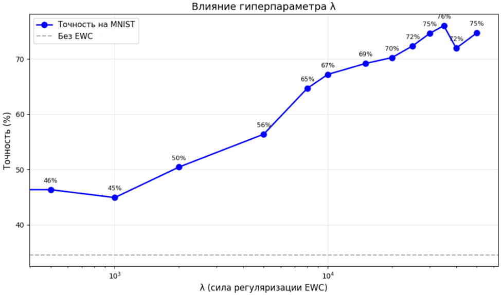
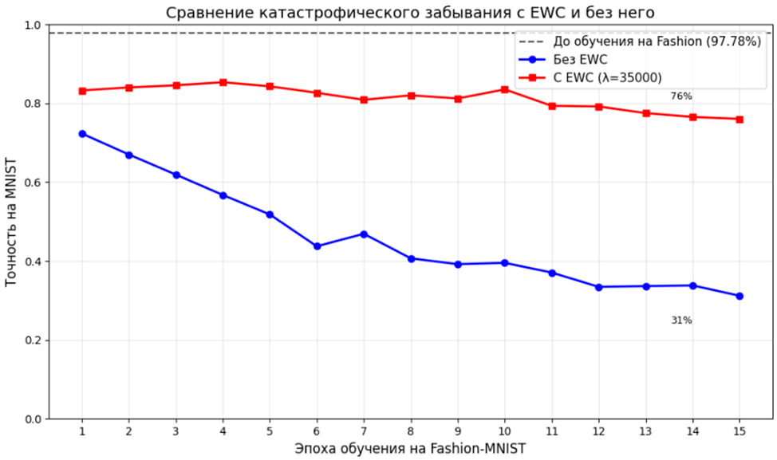

**ИССЛЕДОВАНИЕ КАТАСТРОФИЧЕСКОГО ЗАБЫВАНИЯ В ПОЛНОСВЯЗНЫХ НЕЙРОННЫХ СЕТЯХ И МЕТОД ЕГО СМЯГЧЕНИЯ С ПОМОЩЬЮ ЭЛАСТИЧНОГО ЗАКРЕПЛЕНИЯ ВЕСОВ (EWC) ПРИ ПОСЛЕДОВАТЕЛЬНОМ ОБУЧЕНИИ НА ДАТАСЕТАХ MNIST И FASHION-MNIST**

**Аннотация**

В статье исследуется проблема катастрофического забывания в полносвязной нейронной сети при последовательном обучении. На первом этапе сеть обучается распознаванию рукописных цифр из датасета MNIST, на втором — изображений одежды из Fashion-MNIST без доступа к исходным данным. Показано, что без использования защитных механизмов точность на MNIST падает с 97.78% до 31.2% после 15 эпох обучения на Fashion-MNIST. Применение метода эластичного закрепления весов (EWC) с оптимальным значением гиперпараметра $\lambda = 35000$ позволяет повысить сохранённую точность до 76.0% при незначительном изменении точности на Fashion-MNIST (88.0% против 88.1%). Результаты демонстрируют эффективность EWC для смягчения катастрофического забывания, а также показывают критическую зависимость метода от выбора коэффициента регуляризации.

**Введение**

Нейронные сети показывают высокую эффективность при решении одной конкретной задачи, но сталкиваются с проблемами при последовательном обучении. Если их обучить сначала на одном наборе данных, а потом на другом, возникает проблема: сеть резко теряет способность решать первую задачу. Это называется катастрофическим забыванием.

Особенно заметно это в сценарии последовательного обучения, когда старые данные становятся недоступны. Например, нейронная сеть сначала учится распознавать одни объекты, а потом другие — и утрачивает ранее приобретённые навыки. Без специальных механизмов избежать этого практически невозможно.

Один из подходов к решению — метод Elastic Weight Consolidation (EWC). Его идея в том, чтобы защитить важные для старой задачи веса от сильных изменений. Важность оценивается по матрице Фишера, и чем выше важность, тем сильнее штраф при попытке изменить вес. Метод предложили исследователи из DeepMind в 2017 году [1], и он хорошо показал себя на простых сценариях.

В данной работе EWC применяется к полносвязной сети, которая последовательно обучается на двух популярных датасетах: MNIST (рукописные цифры) и Fashion-MNIST (одежда). Сначала сеть учится распознавать цифры, потом — одежду, причём на втором этапе цифры ей уже не показываются.

Цель работы — проверить, насколько сильно падает точность на первой задаче и удаётся ли EWC смягчить это падение. Для сравнения проведены два эксперимента: обычное последовательное обучение (без защиты) и с использованием EWC. Результаты оцениваются по точности на обоих датасетах.

**Методы**

Архитектура сети — стандартная полносвязка с тремя слоями: вход 784 нейрона (пиксели $28 \times 28$, нормализованные в $[0,1]$), два скрытых слоя на 256 и 128 нейронов с ReLU, выходной слой на 10 нейронов с Softmax.

Dropout и batch normalization не применялись, чтобы избежать дополнительных факторов, влияющих на интерпретацию результатов.

Эксперименты проводились на двух популярных датасетах: MNIST [3] и Fashion-MNIST [4]. Оба содержат по 60 000 тренировочных и 10 000 тестовых изображений размером $28 \times 28$, каждый имеет 10 классов. Разница в том, что MNIST — рукописные цифры, а Fashion-MNIST — изображения одежды.

Обучение организовано последовательно в два этапа. На первом этапе сеть обучается на MNIST. Параметры обучения: оптимизатор Adam со скоростью обучения (learning rate) $0.001$, размер батча (batch size) $64$, функция потерь — `categorical_crossentropy`, количество эпох — 15. На втором этапе, без сброса весов, сеть обучается на Fashion-MNIST с теми же гиперпараметрами. Доступ к данным MNIST на втором этапе отсутствует. На каждой эпохе второго этапа фиксируется текущая точность на тестовой выборке MNIST — это позволяет отслеживать динамику забывания.

Для смягчения забывания применяется метод Elastic Weight Consolidation (EWC). После обучения на MNIST сохраняются веса сети $\theta^*$ и вычисляется матрица Фишера в диагональном приближении [1]:

$$F_i = \mathbb{E}\left[\left(\frac{\partial L}{\partial \theta_i}\right)^2\right]$$

На практике $F_i$ оценивается как средний квадрат градиента по 2000 случайным примерам из MNIST. При обучении на Fashion-MNIST итоговая функция потерь принимает вид [1]:

$$L(\theta) = L_{\text{fashion}}(\theta) + \frac{\lambda}{2} \sum_i F_i (\theta_i - \theta^*_i)^2$$

Здесь $\lambda$ — гиперпараметр, регулирующий силу регуляризации. При $\lambda = 0$ выражение сводится к обычному последовательному обучению (базовый эксперимент). При слишком больших $\lambda$ сеть стремится сохранить старые веса, но может хуже обучаться новой задаче.

Все эксперименты проведены с фиксацией random seed = 42 для обеспечения воспроизводимости результатов.

**Результаты**

В ходе экспериментов оценивалась точность на тестовых выборках MNIST и Fashion-MNIST. Сначала измерялась точность на MNIST после первого этапа обучения. Затем, после последовательного обучения на Fashion-MNIST (15 эпох), фиксировалась итоговая точность на обоих датасетах.

При обучении без использования EWC точность на MNIST упала с 97.78% до 31.2% после 15 эпох обучения на Fashion-MNIST. Точность на Fashion-MNIST при этом составила 88.0%. Это демонстрирует наличие катастрофического забывания в полносвязной сети при последовательном обучении.

Для подбора оптимального коэффициента регуляризации $\lambda$ были протестированы значения от 0 до 50000. Результаты приведены в Таблице 1 и на Рисунке 1.

**Таблица 1 — Влияние $\lambda$ на точность после обучения на Fashion-MNIST**

| $\lambda$ | Точность на MNIST (%) | Точность на Fashion-MNIST (%) |
|-----------|------------------------|-------------------------------|
| 0 | 31.2 | 88.0 |
| 500 | 46.4 | 88.3 |
| 1000 | 44.9 | 88.3 |
| 2000 | 50.4 | 88.1 |
| 5000 | 56.4 | 88.4 |
| 8000 | 64.7 | 88.1 |
| 10000 | 67.2 | 88.1 |
| 15000 | 69.2 | 87.9 |
| 20000 | 70.2 | 88.1 |
| 25000 | 72.4 | 88.0 |
| 30000 | 74.6 | 88.6 |
| 35000 | 76.0 | 88.1 |
| 40000 | 71.9 | 88.3 |
| 50000 | 74.7 | 87.9 |

**Рисунок 1 — Зависимость точности на MNIST от коэффициента регуляризации $\lambda$**

Как видно из Рисунка 1, при увеличении $\lambda$ от 0 до 35000 точность на MNIST растёт, достигая максимума 76.0% при $\lambda = 35000$. Дальнейшее увеличение $\lambda$ до 50000 не даёт прироста и снижается, что объясняется чрезмерной регуляризацией. Оптимальным признано значение $\lambda = 35000$.

Сравнение последовательного обучения без защиты и с использованием EWC при оптимальном $\lambda = 35000$ представлено в Таблице 2 и на Рисунке 2.

**Таблица 2 — Сравнение результатов с EWC и без него**

| Метод | $\lambda$ | Точность MNIST (до) | Точность MNIST (после) | Точность Fashion |
|-------|-----------|---------------------|------------------------|------------------|
| Без EWC | 0 | 97.78% | 31.2% | 88.0% |
| С EWC | 35000 | 97.78% | **76.0%** | 88.1% |

**Рисунок 2 — Динамика точности на MNIST в процессе обучения на Fashion-MNIST**

Применение EWC позволило повысить сохранённую точность на MNIST с 31.2% до 76.0% (прирост 44.8 процентных пункта). Точность на Fashion-MNIST при этом практически не изменилась (88.0% и 88.1% соответственно).

**Анализ и обсуждение**

Полученные результаты подтверждают наличие катастрофического забывания в полносвязной сети при последовательном обучении. Без каких-либо защитных механизмов точность на первой задаче (MNIST) после обучения на второй задаче (Fashion-MNIST) составила всего 31.2%, тогда как исходная точность достигала 97.78%. Это согласуется с известными данными [2] о том, что градиентный спуск при обучении новой задачи быстро изменяет веса, важные для предыдущей, если их ничем не ограничивать.

Применение метода EWC позволило значительно смягчить эту проблему. При оптимальном значении гиперпараметра $\lambda = 35000$ точность на MNIST после обучения на Fashion-MNIST составила 76.0%, что на 44.8 процентных пункта выше базового уровня. При этом точность на Fashion-MNIST практически не изменилась (88.0% против 88.1%). Это означает, что EWC успешно находит баланс между сохранением старых навыков и освоением новых.

Анализ влияния гиперпараметра $\lambda$ (Таблица 1, Рисунок 1) показывает, что при малых значениях ($\lambda < 5000$) регуляризация недостаточна — сеть всё ещё сильно забывает MNIST (точность не превышает 56%). При увеличении $\lambda$ до 35000 точность на MNIST плавно растёт и достигает максимума 76.0%. Дальнейшее увеличение $\lambda$ до 40000–50000 не приводит к улучшению, а в некоторых случаях точность даже снижается (например, 71.9% при $\lambda = 40000$). Это объясняется тем, что слишком сильная регуляризация начинает препятствовать обучению новой задаче — сеть «боится» менять веса даже там, где это необходимо для распознавания одежды.

Следует отметить, что эффективность EWC снижается при увеличении числа последовательных задач. В данной работе рассмотрен двухзадачный сценарий, где метод показывает наилучшие результаты. При добавлении третьей и последующих задач точность на первых задачах начинает постепенно снижаться, так как регуляризационный член накапливается и сеть перестаёт адаптироваться к новым данным.

**Заключение**

В ходе эксперимента подтверждено наличие катастрофического забывания в полносвязной сети при последовательном обучении на датасетах MNIST и Fashion-MNIST. Показано, что без применения специальных методов точность на первой задаче падает с 97.78% до 31.2% после освоения второй.

Применение метода эластичного закрепления весов (EWC) с подобранным коэффициентом регуляризации $\lambda = 35000$ позволило повысить сохранённую точность на MNIST до 76.0% при незначительном изменении точности на Fashion-MNIST (88.0% против 88.1%). Таким образом, EWC является эффективным способом смягчения катастрофического забывания, однако требует аккуратного подбора гиперпараметра $\lambda$ для каждой конкретной задачи и архитектуры сети.

**Список литературы**

1. Kirkpatrick J., Pascanu R., Rabinowitz N., et al. Overcoming catastrophic forgetting in neural networks // Proceedings of the National Academy of Sciences. 2017. Vol. 114, No. 13. P. 3521–3526.
2. McCloskey M., Cohen N.J. Catastrophic interference in connectionist networks: The sequential learning problem // Psychology of Learning and Motivation. 1989. Vol. 24. P. 109–165.
3. LeCun Y., Cortes C., Burges C.J. The MNIST database of handwritten digits. 1998.
4. Xiao H., Rasul K., Vollgraf R. Fashion-MNIST: a novel image dataset for benchmarking machine learning algorithms. arXiv:1708.07747. 2017.